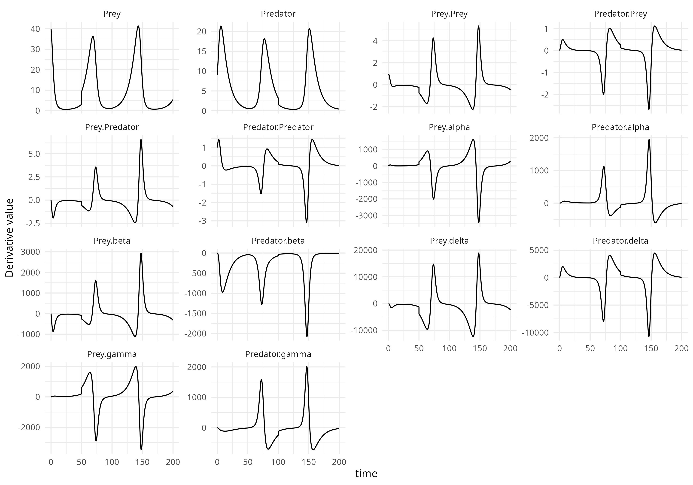

# JuliaODE: Interface for ODE Solvers and Automatic Generation of Julia Code from R

The `JuliaODE` package provides an interface between R and Julia for solving ordinary differential equations (ODEs). It not only generates Julia code for ODE models but also creates a seamless integration with Julia’s powerful ODE solvers, allowing you to solve ODEs and perform sensitivity analysis directly from R. This package also supports event handling and Jacobian computation (sensitivity analysis).

## Table of Contents

1. [Introduction](#introduction)
2. [Installation](#installation)
    - [Prerequisites](#prerequisites)
    - [Package Installation](#package-installation)
3. [Usage](#usage)
    - [Function: `juliaODEmodel`](#function-juliaodemodel)
    - [Example](#example)
    - [Events](#events)
4. [Notes](#notes)
5. [License](#license)

---

## Introduction

The `JuliaODE` package offers the following features:

- **Automatic Julia Code Generation**: Define ODE models in R, and the package generates the corresponding Julia code for solving them.
- **Seamless Solver Interface**: Integrates with Julia’s `OrdinaryDiffEq` and `ForwardDiff` libraries to solve ODEs and compute Jacobians for sensitivity analysis.
- **Event Handling**: Supports defining discrete events that trigger at specific times during the simulation (e.g., variable resets or updates).
- **Sensitivity Analysis**: Supports computing the Jacobian of the system, providing insights into parameter sensitivities.

This integration between R and Julia allows you to utilize Julia's computational power while working in R, making it easy to prototype and solve ODE models.

---

## Installation

### Prerequisites

Ensure that the following software is installed:

- **R**: Version 4.0.0 or higher
- **Julia**: [Download from the official Julia website](https://julialang.org/downloads/) (Version 1.6 or higher)
- **R Package**: `JuliaConnectoR` to facilitate communication between R and Julia.

### Package Installation

To install the `JuliaODE` package from GitHub, use the following commands:

```r
# Install devtools if not already installed
install.packages("devtools")

# Install JuliaODE from GitHub
devtools::install_github("simonbeyer1/JuliaODE")
```

---

## Usage

### Function: `juliaODEmodel`

The core function of the `JuliaODE` package is `juliaODEmodel`, which generates Julia code for an ODE model and provides an interface to solve it using Julia’s solvers.

#### Syntax

```r
juliaODEmodel(odefunction, modelname = "odemodel", file = paste0(modelname, ".jl"), events = NULL)
```

#### Arguments

- **odefunction**: A named list where the names are the dynamic variables, and the values are the corresponding ODEs as strings.
- **modelname**: The name of the Julia model function. Default is `"odemodel"`.
- **file**: The filename where the generated Julia code will be saved. Default is constructed as `paste0(modelname, ".jl")`.
- **events**: An optional data frame specifying events to occur at certain times. The data frame must include the columns `"var"`, `"time"`, `"value"`, and `"method"`. The `"value"` column can contain expressions involving dynamic variables and parameters (e.g., `"0.5 * A"`, `"k2"`).

#### Return Value

The `juliaODEmodel` function returns an object with the following attributes:

- **`equations`**: The ODE equations passed to the function.
- **`variables`**: The dynamic variables in the system.
- **`parameters`**: The parameters in the system.
- **`events`**: The events data frame (if provided).
- **`modelname`**: The name of the generated Julia model.
- **`juliacode`**: The generated Julia code.

The returned object contains two methods:

- `solve(x0, dynpars, times, solver = "AutoTsit5(Rosenbrock32())", atol = 1e-8, rtol = 1e-6)`: Solves the ODE system.
- `senssolve(x0, dynpars, times, solver = "AutoTsit5(Rosenbrock32())", atol = 1e-8, rtol = 1e-6)`: Solves the ODE system and computes sensitivities (Jacobian).

### Example

```r
# Load libraries
library(JuliaODE)
library(ggplot2)
library(reshape2)

# Define Lotka Volterra ODE system
odefunction <- list(
  Prey = "alpha * Prey - beta * Prey * Predator",
  Predator = "delta * Prey * Predator - gamma * Predator"
)

# Generate the Julia model
odemodel <- juliaODEmodel(odefunction, modelname = "LotkaVolterra")

# Initial conditions and parameters
inits <- c(Prey = 40, Predator = 9)
params <- c(alpha = 0.1, beta = 0.02, delta = 0.01, gamma = 0.1)
times <- seq(0, 200, length.out = 500)

# Define events 
events <- data.frame(
  var = c("Prey", "Predator"),
  time = c(50, 100),
  value = c("2 * Prey", "Predator / 2"),
  method = c("add", "rep")
)

# Generate the Julia model
odemodel <- juliaODEmodel(odefunction, modelname = "LotkaVolterra", events = events)


# Solve the ODE system without sensitivities
solution <- odemodel$solve(inits, params, times)
head(solution)

# Solve the ODE system with sensitivities
solution_sens <- odemodel$senssolve(inits, params, times)

# plotting
out_sens <- melt(as.data.frame(solution_sens), id.vars = "time", variable.name = "name", value.name = "value")
ggplot(out_sens, aes(x = time, y = value)) +
  geom_line() +
  facet_wrap(~ name, scales = "free_y") +
  labs(
    x = "time",
    y = "Derivative value"
  ) + theme_minimal()
```
<!-- -->

### Events

If you have events in your model, you can define them using the `events` DataFrame. Each event includes:

- **`var`**: The affected variable.
- **`time`**: The time at which the event should be triggered.
- **`value`**: The value to assign to the variable.
- **`method`**: The event method: `"add"`, `"mult"`, or `"rep"` (replace).

#### Supported Event Methods:
- **`add`**: Adds the value to the variable.
- **`mult`**: Multiplies the variable by the value.
- **`rep`**: Replaces the variable with the value.

The package supports adding, multiplying, or replacing variable values at specific times.

---

## Notes

- **Julia Dependencies**: When you load the package, it automatically checks if the required Julia packages (`OrdinaryDiffEq`, `ForwardDiff`) are installed. If not, they will be installed automatically.
- **`JuliaConnectoR`**: This library enables communication between R and Julia. Ensure it is installed and properly set up.

```r
# To install JuliaConnectoR:
install.packages("JuliaConnectoR")
```

- The `juliaODEmodel` function generates Julia code for both the ODE model and event handling, ensuring that all the necessary components for solving the ODE system are included.

---

## License

This package is licensed under the [MIT License](LICENSE).
